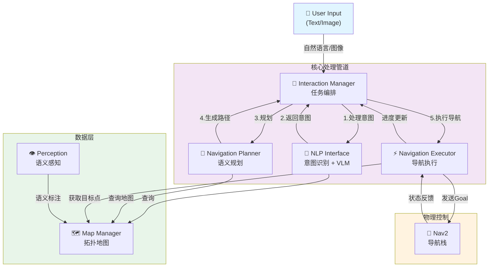
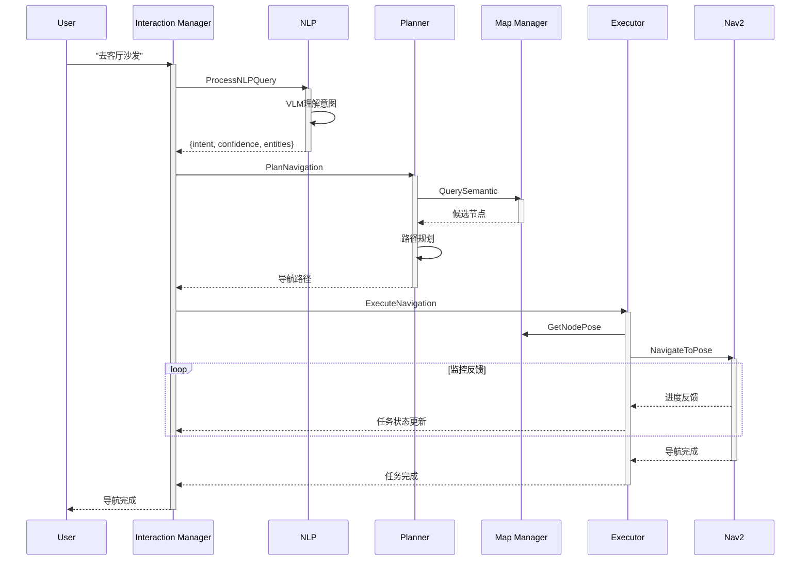

# SSTG Navigation System

[](https://docs.ros.org/en/humble/)
[](https://www.python.org/)
[](LICENSE)

**Spatial Semantic Topological Graph Navigation System** - 智能机器人导航的完整解决方案

## 🌟 项目概述

SSTG导航系统是一个基于ROS2的智能机器人导航框架，集成了自然语言理解、语义地图构建、拓扑路径规划和导航执行功能。通过多模态输入（文本+图像），系统能够理解用户的导航意图，规划智能路径，并控制机器人安全到达目标位置。

### ✨ 核心特性

- 🗣️ **自然语言导航**: 支持自然语言指令，如"去客厅沙发"或"带我去厨房"
- 🧠 **语义理解**: 集成VLM（Vision-Language Model）进行智能场景理解
- 🗺️ **拓扑地图**: 基于图结构的语义空间表示
- 🤖 **智能规划**: 语义驱动的路径规划和决策
- 📊 **实时监控**: 完整的导航状态反馈和进度跟踪
- 🔄 **任务管理**: 支持任务取消、状态查询和错误恢复

## 📦 系统架构

### 整体数据流



### 模块职责说明

| 模块 | 职责 | 输入 | 输出 |
|------|------|------|------|
| **Interaction Manager** | 任务协调、状态管理 | 用户命令 | 任务状态、反馈 |
| **NLP Interface** | 自然语言理解、意图识别 | 文本/图像 | 结构化意图 |
| **Navigation Planner** | 语义路由规划、候选点生成 | 意图、地图 | 导航路径 |
| **Map Manager** | 地图存储、语义查询、节点管理 | 查询请求 | 节点信息、拓扑图 |
| **Navigation Executor** | 导航执行、进度监控、反馈 | 目标位置 | 导航状态、反馈 |
| **Perception** | 多模态感知、语义标注 | 图像、场景 | 语义标签、对象信息 |
| **Nav2** | 底层路径规划、障碍避免、控制 | 目标姿态 | 运动指令 |

### 核心数据流示例



### 工作空间拓扑

```
~/sstg-nav/
│
├── 📁 sstg_nav_ws/                  # SSTG导航系统工作空间
│   ├── src/
│   │   ├── sstg_msgs/               # 消息定义
│   │   ├── sstg_map_manager/        # 地图管理
│   │   ├── sstg_nlp_interface/      # 自然语言处理
│   │   ├── sstg_navigation_planner/ # 路径规划
│   │   ├── sstg_navigation_executor/# 导航执行
│   │   ├── sstg_interaction_manager/# 任务编排
│   │   └── sstg_perception/         # 感知模块
│   ├── build/ & install/
│   └── README.md & INSTALLATION.md
│
└── 📁 yahboomcar_ws/                # YahboomCar工作空间
    └── src/                         # 机器人控制包（不含SSTG）
```

### 核心组件

1. **`sstg_interaction_manager`** - 任务编排和系统协调
   - 管理导航任务的完整生命周期
   - 协调各模块的通信
   - 提供任务状态查询和取消功能

2. **`sstg_nlp_interface`** - 自然语言处理和意图识别
   - 集成VLM（Vision-Language Model）进行语义理解
   - 支持多模态输入（文本、图像）
   - 提取用户意图和实体信息

3. **`sstg_navigation_planner`** - 语义路径规划
   - 基于意图的语义匹配
   - 拓扑路径规划
   - 候选点生成与排序

4. **`sstg_navigation_executor`** - Nav2导航执行和监控
   - Nav2集成与通信
   - 实时导航反馈
   - 进度监控和状态报告

5. **`sstg_map_manager`** - 拓扑地图管理
   - 地图构建与存储
   - 语义节点查询
   - Web可视化界面

6. **`sstg_perception`** - 多模态感知和语义标注
   - 图像捕获与处理
   - VLM语义标注
   - 物体识别和场景理解

7. **`sstg_msgs`** - 统一接口定义
   - 7个核心消息类型
   - 8个服务接口
   - 标准化通信格式

## � 工作空间架构

本项目采用**分离式工作空间架构**，SSTG导航系统与YahboomCar机器人控制系统独立管理：

```
~/sstg-nav/
├── sstg_nav_ws/              # ⭐ SSTG导航系统独立工作空间
│   ├── src/
│   │   ├── sstg_interaction_manager/
│   │   ├── sstg_map_manager/
│   │   ├── sstg_msgs/
│   │   ├── sstg_navigation_executor/
│   │   ├── sstg_navigation_planner/
│   │   ├── sstg_nlp_interface/
│   │   └── sstg_perception/
│   ├── build/
│   ├── install/
│   └── log/
│
└── yahboomcar_ws/            # YahboomCar机器人控制工作空间
    ├── src/                  # 亚博机器人相关包（不再含SSTG）
    ├── build/
    ├── install/
    └── log/
```

**设计优势**：
- ✅ 代码职责分离，便于独立开发维护
- ✅ SSTG系统可独立版本控制和发布
- ✅ 便于跨机器人平台集成（不仅限YahboomCar）
- ✅ 构建和测试互不干扰

## 🚀 快速开始

### 系统要求

- **ROS2**: Humble Hawksbill
- **Python**: 3.10+
- **操作系统**: Ubuntu 22.04
- **硬件**: 兼容Nav2的机器人（如Yahboom ROS2）

### 安装步骤

1. **构建SSTG导航系统**（必需）
   ```bash
   cd ~/sstg-nav/sstg_nav_ws
   colcon build --symlink-install
   source install/setup.bash
   ```

2. **可选：构建YahboomCar工作空间**（如使用Yahboom机器人）
   ```bash
   # 在另一个终端中
   cd ~/sstg-nav/yahboomcar_ws
   colcon build --symlink-install
   source install/setup.bash
   ```

3. **启动SSTG系统**
   ```bash
   # 确保已source SSTG工作空间
   source ~/sstg-nav/sstg_nav_ws/install/setup.bash
   
   # 使用集成测试脚本（推荐，自动初始化地图、启动所有节点、运行测试）
   cd ~/sstg-nav
   ./project_test/run_tests.sh

   # 或手动启动各组件
   ros2 run sstg_map_manager map_manager_node &
   ros2 run sstg_nlp_interface nlp_node &
   ros2 run sstg_navigation_planner planning_node &
   ros2 run sstg_navigation_executor executor_node &
   ros2 run sstg_interaction_manager interaction_manager_node &
   ```

4. **验证安装**
   ```bash
   # 检查服务可用性
   ros2 service list | grep sstg
   ```

### 基本使用

```bash
# 发送中文导航指令
ros2 service call /start_task sstg_msgs/srv/ProcessNLPQuery "{
  text_input: '去客厅沙发',
  context: 'home environment'
}"

# 查询任务状态
ros2 service call /query_task_status std_srvs/srv/Trigger

# 取消当前任务
ros2 service call /cancel_task std_srvs/srv/Trigger
```

## 📊 测试和验证

### 运行集成测试

```bash
# 完整集成测试（推荐）
./project_test/run_tests.sh
```

此脚本自动执行以下步骤：
1. 初始化测试拓扑地图
2. 启动所有 5 个 ROS2 节点
3. 运行完整系统集成测试
4. 自动清理并生成测试报告

**测试结果位置**: `project_test/integration_test_report.md`

### 测试覆盖范围

- ✅ 服务可用性检查（7 个核心服务）
- ✅ 中文自然语言导航任务
- ✅ 任务状态查询
- ✅ NLP 意图识别
- ✅ 拓扑地图匹配和规划

## 📚 文档资源

- **[用户指南](SSTG_User_Guide.md)** - 完整使用手册和实验指导
- **[项目总结](PROJECT_SUMMARY.md)** - 开发完成情况和项目亮点
- **[技术规划](SSTG-Nav-Plan.md)** - 系统架构和设计文档
- **[开发进度](PROJECT_PROGRESS.md)** - 详细开发历程

### 各模块文档

- `sstg_*/README.md` - 模块使用说明
- `sstg_*/doc/` - 详细技术文档
- `project_test/` - 测试脚本和结果

## 🎯 示例应用

### 家庭服务机器人

```bash
# 日常任务
ros2 service call /start_task sstg_msgs/srv/ProcessNLPQuery "{
  text_input: 'Bring me a cup from the kitchen',
  context: 'home assistance'
}"
```

### 商业环境导航

```bash
# 导览服务
ros2 service call /start_task sstg_msgs/srv/ProcessNLPQuery "{
  text_input: 'Take me to the conference room on the second floor',
  context: 'office building'
}"
```

### 多模态交互

```bash
# 图像+文本导航
ros2 service call /start_task sstg_msgs/srv/ProcessNLPQuery "{
  text_input: 'Go to where the red chair is',
  context: 'living room',
  image_data: '<base64_encoded_image>'
}"
```

## 🔧 开发和扩展

### 添加新功能

```bash
# 创建新的ROS2包
ros2 pkg create --build-type ament_python sstg_your_feature

# 继承基础服务接口
from sstg_msgs.srv import YourCustomService
```

### 自定义配置

```yaml
# config/navigation.yaml
planner:
  semantic_weight: 0.8
  topological_weight: 0.2
executor:
  feedback_rate: 10.0  # Hz
```

### 性能监控

```bash
# 系统资源监控
ros2 topic echo /navigation_feedback

# 性能分析
ros2 run rqt_runtime_monitor rqt_runtime_monitor
```

## 🤝 贡献指南

1. Fork 项目
2. 创建功能分支 (`git checkout -b feature/AmazingFeature`)
3. 提交更改 (`git commit -m 'Add some AmazingFeature'`)
4. 推送到分支 (`git push origin feature/AmazingFeature`)
5. 创建 Pull Request

### 开发规范

- 遵循ROS2 Python代码规范
- 添加完整的单元测试
- 更新相关文档
- 通过所有集成测试

## 📄 许可证

本项目采用 Apache 2.0 许可证 - 查看 [LICENSE](LICENSE) 文件了解详情。

## 🙏 致谢

- **ROS2社区**: 提供优秀的机器人框架
- **Yahboom**: 机器人硬件支持
- **开源社区**: NetworkX, FastAPI等优秀工具

## 📞 联系方式

**项目维护者**: Daojie Peng
- Email: Daojie.PENG@qq.com
- 项目日期: 2026-03-25
- 状态: ✅ **Phase 4 Complete - Production Ready**

---

**🎉 SSTG导航系统 - 让机器人真正理解你的意图！**